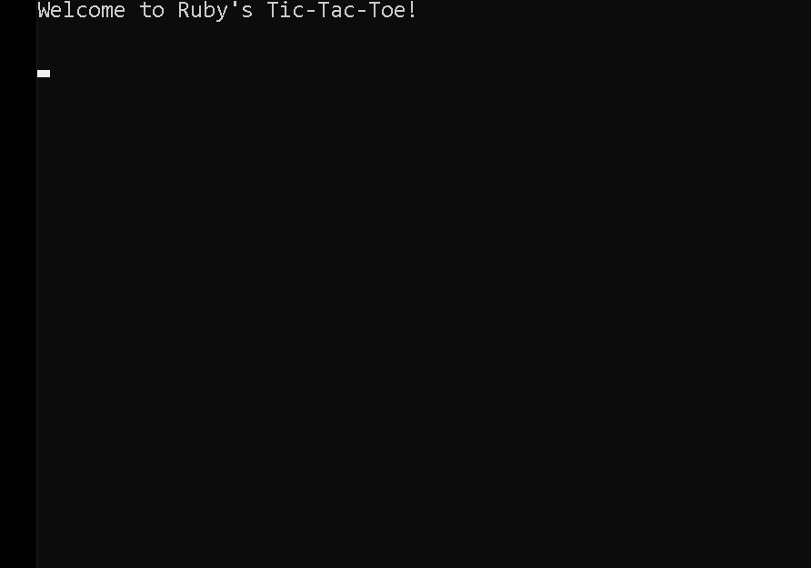

# Tic_tac_toe_game


> This is a collaborative project to reproduce the Tic Tac Toe game in console with Ruby language by respecting the OOP concept.


## Getting Started

Let us guide you through how you can get our repository in your local machine.

### Prerequisites
- First, you need to make sure you hava a text editor already installed in your machine. We used Vscode if you don't have anyone you can download it for free.
- Second most important is to make sure you've Ruby installed in your machine. type this in your terminal to make sure you are alright.

```console
ruby -v
```

### Setup

Know we are sure you have the minimum requirements, you can follow those instructions to get our reposiroty :

* Open your terminal and locate yourself on the folder you want to clone the repository by using the command cd.

* Setup

Create a new folder/directory for the project.
Be sure to have a Github account and that this account is connected locally on your PC.

* Install

  the desired directory on your terminal
  ```
  git clone git@github.com:mrigorir/TicTacToe.git
  ```

* Move to the repository cloned

```
cd TicTacToe/
```
Then if you are running a unix machine type direclty main to run the program
````
main
````
or 
```
ruby main
```
if you are on Windows.

## Tic Tac Toe's rules



- The game starts with both player choosing their pseudo.
- Player 1 is playing as 'X', while player 2 plays as 'O'
- The game starts with player 1 choosing an available cell in the board and then player 2 choosing an available cell in the board
- A player wins by getting 3 cells marked with their letter, either horizontally, vertically or diagonally
- If none of the players is able to win before the board runs out of available squares it's declared a draw.
- Enjoy

## Authors

👤 **Anvi Alex Eponon**

- GitHub: [Anvi98](https://github.com/Anvi98)
- Twitter: [@anvi_al](https://twitter.com/anvi_al)
<<<<<<< HEAD
- LinkedIn: [Anvi Alex](https://www.linkedin.com/in/anvi-alex-eponon/)

👤 **Marco Para**

- GitHub: [@mrigorir](https://github.com/mrigorir)
- Twitter: [@marcoparra311](https://twitter.com/marcoparra311)
- LinkedIn: [Marco Parra](https://linkedin.com/in/marco-alonso-parra/)
=======
- LinkedIn: [@anvi98](https://www.linkedin.com/in/anvi-alex-eponon/)

👤 **Marco Para**

- GitHub: [mrigorir](https://github.com/mrigorir)
- Twitter: [@Marco](https://twitter.com/marcoparra311)
- LinkedIn: [Marco](https://www.linkedin.com/in/marco-alonso-parra/)
>>>>>>> 94a1312fd378bdf1b787aa0e0e81da4ce27e2a8e

## 🤝 Contributing

Contributions, issues, and feature requests are welcome!

Feel free to check the [issues page](https://github.com/mrigorir/TicTacToe/issues).

## Show your support

Give a ⭐️ if you like this project!

## Acknowledgments

- Thanks to Microverse and their supportive community.
- Thanks to everyone committing to this project.

## 📝 License

<<<<<<< HEAD
This project is [MIT](./LICENSE) licensed.
=======
This project is [MIT](./MIT.md) licensed.
>>>>>>> 94a1312fd378bdf1b787aa0e0e81da4ce27e2a8e
